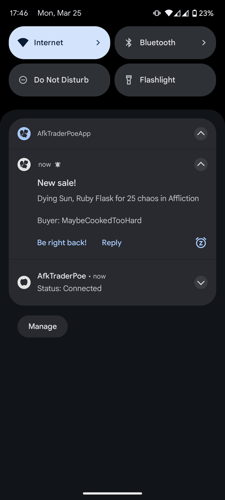
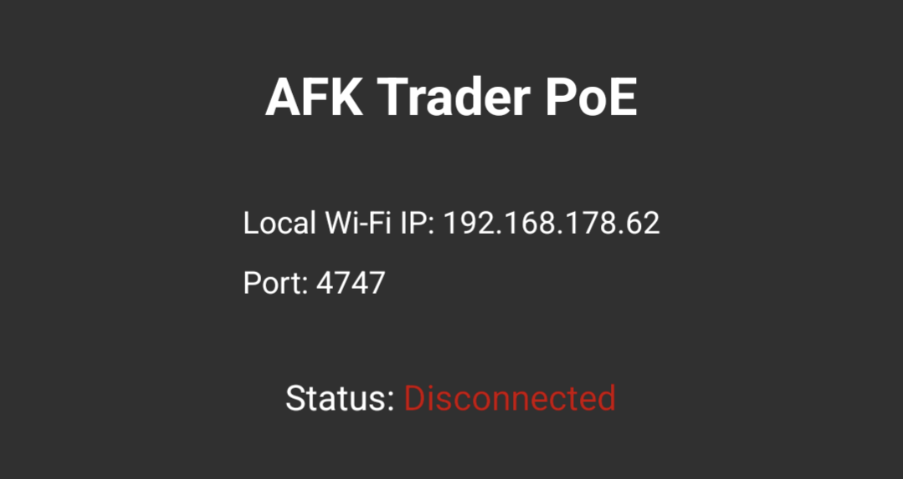
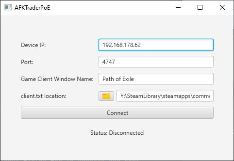

# AFKTraderPoE

This app allows you to receive trade messages on your phone. Never miss out on
juicy trades while AFK again!

## Features
- Receive Notifications about incoming trade messages on your phone
- Send a quick reply with one button press to let the buyer know you'll be right back
- Send a custom reply

## Installation
Head over to the [Releases](https://github.com/RealWhimsy/AFKTraderPoE/releases) page and download both the
AfkTraderPoe_Desktop.zip and AFKTraderPoE_Android.apk files.

### Android app
- Move the AFKTraderPoE_Android.apk file to your phone
- Locate the .apk file on your phone and tap to install
- If prompted, open the settings and allow installing Apps from unknown sources

### Desktop App
- Extract the AfkTraderPoe_Desktop.zip file in your desired location.
- Click on the AfkTraderPoe.exe to launch the application

## Connecting your PC and your phone
- Open the .exe file on your PC and launch the app on your phone.
- In the desktop app there should be input fields for ip address and port.
Enter the values that are displayed in the app on your phone. Make sure
the values match. (See images below)
- In the desktop app, use the folder browser next to "client.txt location"
to locate your game's client.txt file. Usually this should be in the game's
"logs" folder inside the game's installation folder. A common location when
the game is installed via Steam would be: C:\Program Files (x86)\Steam\steamapps\common\Path of Exile\logs\Client.txt
- In "Game Client Window" enter the name of your Path of Exile window. 
This should just be "Path of Exile" per default. You can check this by hovering
over the "Path of Exile" window icon on your task bar while the game is running.
- Now open the app on your phone and hit the "Connect" button on the desktop app.
The status should change to "Connected" and you are now ready to receive trade messages.

